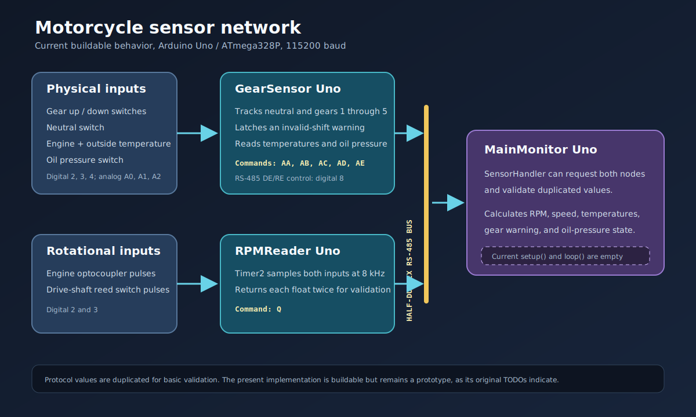

# MainMonitor

`MainMonitor` is intended to be the central consumer in the motorcycle electronics system. It owns the RS-485 master-side `SensorHandler`, requests data from [GearSensor](https://github.com/NoX2SR/GearSensor) and [RPMReader](https://github.com/NoX2SR/RPMReader), validates duplicated values, and converts raw sensor data into values a dashboard can display.



This project exists separately because presentation and coordination change at a different pace from the small sensor nodes. The sensor Arduinos can stay focused on local acquisition while the monitor combines their data into gear, warning, temperature, oil-pressure, engine-RPM, and road-speed state.

## Current status

The architecture is only partially connected:

- `SensorHandler` now compiles as part of the Arduino project.
- `MainMonitor.ino` deliberately still has empty `setup()` and `loop()` functions.
- No `SensorHandler` instance is constructed and no polling occurs on hardware yet.

That preserves the existing runtime behavior while making the unfinished handler visible to the compiler and tests.

## Intended data flow

`SensorHandler::RefreshVariables()` is designed to:

1. Clear temporary converter state.
2. Send `QQ` to the RPM node and read duplicated binary frequency values.
3. Send `AA` to the gear node and read duplicated ASCII gear, warning, temperature, and oil-pressure values.
4. Update a stored value only when both copies agree and the response sensor ID is correct.

Public getters then expose:

| Getter | Current calculation |
| --- | --- |
| `GetCurentGear()` | Last accepted gear `0` through `5` |
| `GetGearWarning()` | Last accepted shift warning |
| `GetOutTemperature()` | Stored value divided by 10 |
| `GetEngineTemperature()` | Stored value divided by 10 |
| `GetRPMs()` | Engine frequency multiplied by 60 |
| `GetSpeed()` | Existing four-magnet, drive-ratio, and 80 cm tire formula |
| `GetOilPreasure()` | Last accepted low-pressure state |

The temperature conversion is explicitly a placeholder. The speed constants and interpretation also need confirmation against the actual motorcycle gearing, sensor placement, and tire measurement before they should be trusted.

## Hardware assumptions

Target: Arduino Uno / ATmega328P, with hardware serial at 115200 baud.

| Pin | Purpose |
| --- | --- |
| D8 by default | RS-485 DE/RE control |
| D0/D1 | Hardware serial bus |

The implementation accesses AVR UART0 registers directly while waiting for transmission completion, so it is not currently portable to arbitrary Arduino boards.

## Protocol expectations

The handler identifies the gear node as `A` and the RPM node as `Q`. Values are duplicated and accepted only when both copies compare equal.

There are known protocol inconsistencies that are intentionally not redesigned in this pass:

- The handler sends `QQ`, while `RPMReader` consumes one `Q` command at a time.
- `RPMReader` currently emits a 23-byte full response, while the handler allocates for 19 bytes.
- ASCII delimiters are used around arbitrary binary float bytes, so payload data can equal the delimiter.
- Receive loops currently trust the amount and termination of available serial data.

These points need a protocol decision before monitor polling is enabled.

## Build and test

On Debian or Ubuntu, install the AVR toolchain if needed:

```bash
sudo apt install arduino-builder arduino-core-avr gcc-avr avr-libc
```

Then run:

```bash
make verify
```

Firmware artifacts are written to `build/firmware/`. Native tests exercise public calculations, duplicate-value acceptance, ID rejection, gear/warning parsing, temperature and oil parsing, float decoding, string segmentation, and serial flushing. `SensorHandler.cpp` currently has 57.86% line coverage; the untested section is primarily the blocking hardware serial request/receive flow.

## Wokwi simulation

The included `diagram.json` and `wokwi.toml` load the current monitor firmware onto an Uno and expose UART RX/TX and D8 DE/RE through a logic analyzer and indicator LED.

```bash
make build
```

Open `diagram.json` and run `Wokwi: Start Simulator`. An idle board is the expected result because `MainMonitor.ino` still has empty `setup()` and `loop()` functions. The diagram is a useful starting point once polling is enabled, but it does not pretend that the MAX485 bus or the two remote firmware images are already simulated.

A full three-node simulation needs a deliberate communication model. Wokwi does not provide a documented native MAX485 part, and a single project configuration points at one firmware image. Practical options are a custom Wokwi RS-485 chip, a UART-level integration harness, or hardware-in-the-loop testing with the real transceivers.

## Editor setup

The checked-in `.vscode` configuration points IntelliSense at the Debian Arduino AVR core, Uno variant, AVR compiler, and local `SensorHandler` headers. Open this repository directly, or use `Motorcycle.code-workspace` from the parent directory to open all three Git repositories as a multi-root workspace.

## Before enabling the monitor loop

- Confirm the exact RS-485 request and response framing for both nodes.
- Define receive timeouts, maximum lengths, and malformed-frame behavior.
- Confirm temperature sensor types and calibration curves.
- Confirm pulses per engine revolution, shaft magnets, final-drive ratio, and tire circumference.
- Decide what the monitor should do with one bad duplicate, a missing node, or stale values.
- Validate RS-485 termination, biasing, grounding, and transient protection on the motorcycle.

## License

This project is source-available under the [PolyForm Noncommercial License 1.0.0](LICENSE). Noncommercial study, experimentation, modification, and sharing are permitted under its terms. Commercial use requires a separate written license from NoX2SR. See [NOTICE](NOTICE).

Third-party components remain under their own licenses.
